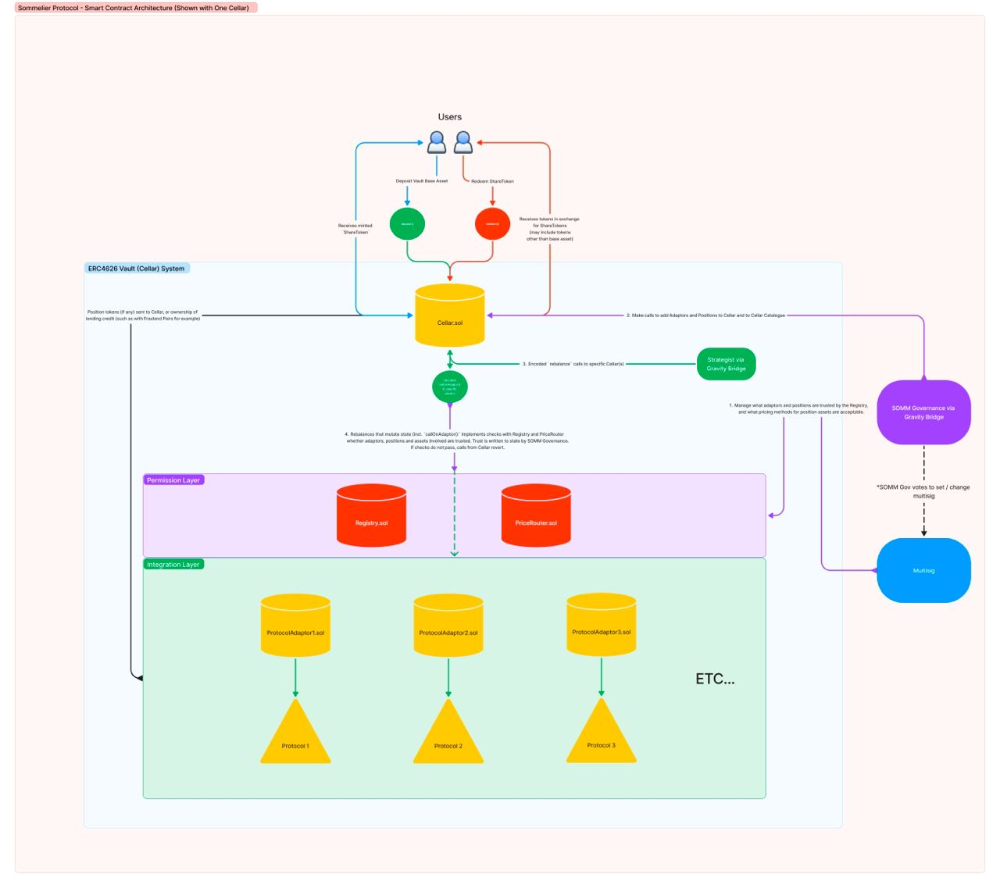

# 🏗 scaffold-eth | 🏰 BuidlGuidl

> This is still a WIP and not a fully-ready challenge. Please contact @steve0xp if you are interested in contributing to finishing this challenge or want to learn more. 

# 🚩 🍷 DeFi Challenge 2: Sommelier ERC4626 Adaptor**

This challenge is focused on guiding students through the following:

- 💡 What ERC4626 Vaults are
- 👀 The typical ins and outs of a Sommelier strategy to be aware of that Sommelier v2.5 Vaults (Cellars) take with their actual strategies. This challenge was based on smart contract work carried out within this [repo](https://github.com/PeggyJV/cellar-contracts). 
    - THIS CHALLENGE AND THE CODE INVOLVED ARE NOT TO BE USED FOR PRODUCTION CODE. IT IS FOR EDUCATIONAL PURPOSES ONLY.
- 💪🏼 Writing this Sommelier Adaptor to integrate with Aura Protocol and getting experience dealing with some types of the basics.

> TODO: 💬 Meet other builders in the [DeFi Challenge 2 Telegram!](insert LINK HERE)

💡✨ This serves as the first of possibly many ERC4626 Adaptor Challenges / Tutorials focused on the creation and usage of "APIs" for different external projects. If you are interested in writing new Challenges / Tutorials, please reach out to @steve0xp && @austingriffith.
---

## ** Prerequisite **  
🙏 Please look into most of the links we have found that it makes the learning curve easier and faster 

1. [ERC 20](https://ethereum.org/en/developers/docs/standards/tokens/erc-20/)
2. [EIP 4626](https://eips.ethereum.org/EIPS/eip-4626)
3. [Openzeppelin Docs on ERC4626](https://docs.openzeppelin.com/contracts/4.x/erc4626)
4. [Aura docs](https://docs.aura.finance/)

## **🚨 1.1 DeFi Sub-Branch Context / Disclaimers**

💫 This challenge is part of the DeFi Sub-Branch, where students are invited to write smart contracts that incorporate actual DeFi protocols. The sub-branch projects are ever-expanding since DeFi is too.

🦸🏼‍♀️ The goal of the Defi sub-branch projects/tutorials are to provide students tutorials that foster self-learning in actual DeFi protocols, guide you through some of the basics of integrating with specific protocols, and other useful tips to increase competence to be potentially hireable as a developer.

> ❗️ NOTE: **Students taking on this challenge will be expected to embrace self-learning AND it is recommended that they have completed all beginner SRE challenges or show competency elsewhere.**

<details markdown='1'><summary>👩🏽‍🏫 More Disclaimers </summary>

💡 The required competency is stated because tying into other protocols is powerful, and with that comes a lot of responsibility when deploying contracts that may end up holding people's actual funds. _These tutorials don't provide you that competency, but they start to show paths for people to become better educated. It is key to know what you are doing._

As well, self-learning is required because tying into DeFi protocols and actual professional crypto projects do not guide developers, step-by-step. If you are new to trying to actually plug into a professional project, no worries! 🤗

We'll touch on some helpful tips as you sort out what the 'norm' is when going through this process. These tips will be specific to each protocol that we are integrating into and learning about.

</details>

---

## 🧱🧱 **2.0 Actual Challenge && Repo Setup**

🚦 To start the challenge, clone the repo to your local machine using the following CLI commands:

TODO: add instructions from the foundry branch to combine scaffold eth v2 and foundry together.

1. Clone the repo onto your local machine and install the submodules: `git clone --recursive <repo link>`

   > NOTE: If you have not installed the submodules, probably because you ran `git clone <repo link>` instead of the CLI command in step 1, you may run into errors when running `forge build` since it is looking for the dependencies for the project. `git submodule update --init --recursive` can be used if you clone the repo without installing the submodules.

2. Install forge on your machine if you have not already: `forge install`

   > NOTE: If you need to download the latest version of foundry, just run `foundryup`

3. Build the project and make sure everything compiles: `forge build`

---

## 🐇 **2.1 Sommelier Context**

🎥👨🏻‍🏫 The Sommelier protocol (Sommelier) is a Yield Aggregator project that has "Strategists" manage on-chain ERC4626 Vaults via the $SOMM chain infrastructure ($SOMM Validator sets, encoded-message transferrance via the Gravity Bridge, and $SOMM Governance). The project touts over 2X growth in TVL (now at 40+Million TVL) over the last 5-6 months and currently operates on Ethereum mainnet.

Since Sommelier uses ERC4626 Vaults, it requires new smart contracts to be made to integrate external protocols to its ERC4626 Vaults. These smart contracts are referred to as `Adaptors`. This tutorial / challenge serves as a written  walkthrough for creating `Adaptors`.

This tutorial is broken into two main parts:

1. ERC4626Agnostic Adaptors: Construction of an ERC4626 Agnostic Adaptor so any ERC4626 Vault can use the core functionalities of it.
2. Sommelier-Specifics: Addition of Sommelier Specific aspects to make the Adaptor integratable with the Sommelier Tech Stack.

---

If you have questions that are outside of the scope of this challenge's TG group chat then we recommend trying to ask a question in the [Sommelier Discord](https://discord.com/invite/ZcAYgSBxvY). As well, feel free to make PRs to the [Sommelier Smart Contracts Github](https://github.com/PeggyJV/cellar-contracts).

Let's get into it! 👨🏻‍💻🧑🏻‍💻👩🏻‍💻

---

## **🏰🔍 2.2 General Architecture**

As mentioned, each Sommelier Vault is an ERC4626 Vault. If you need more context on ERC4626, we recommend checking out these links:

1. [EIP 4626](https://eips.ethereum.org/EIPS/eip-4626)
2. [ERC 4626 Interface & Example Implementation](https://github.com/OpenZeppelin/openzeppelin-contracts/blob/master/contracts/token/ERC20/extensions/ERC4626.sol)
3. [ERC 4626 Alliance](https://erc4626.info/)
4. [Sommelier ERC4626 Implementation](https://github.com/PeggyJV/cellar-contracts/blob/main/src/base/Cellar.sol)
5. [Intro to ERC 4626 from Ethereum](https://ethereum.org/en/developers/docs/standards/tokens/erc-4626/)

As well, if you are not familiar with Aura Protocol, we recommend you check out their docs, app, and github too. To get more and more used to the workflow of a smart contract dev, try having two windows side by side, where one is the challenge in your code editor, and the other are docs / other reference material for the respective area of study.

1. [Aura docs](https://docs.aura.finance/)
2. [Aura github](https://github.com/aurafinance/aura-contracts)
3. [Aura app](https://app.aura.finance/#/)

In case you have not gone through the [Challenge #1: Simple Yearn Strategy](https://github.com/scaffold-eth/Scaffold-ETH-DeFi-Challenges/tree/challenge-1-simple-yearn-strategy), here's some quick context on how vaults work in DeFi.

For each Vault there are typically multiple strategies. These can take various formats, but ultimately it incorporates a Vault contract with multiple `positions` where the Vault's `baseAssets`, often pooled from a collection of users, are used to attain specific compositions of assets. 

These could be as simple as swapping the base asset for a collection of different assets, or using said base asset in LPing positions to generate trading fees. Example in the below image: a `baseAsset` is distributed to different strategies where certain amounts have allocations to it. 

The first part of the tutorial will go through creating adaptors that work for any ERC4626 vault, such that numerous positions could be had with different adaptors for each vault as seen in the below schematic.

 TODO: replace this with Sommelier's proper schematics

💡 Recall: Here, Sommelier Vaults are secure entities that have ownership of the digital assets in question. Within Sommelier, users interact with vaults mainly in the UI, and deposit or withdraw tokens into respective vaults that are isolated to a specific token.

That token is then added to the vault's pile of assets from all involved depositors and Strategists, via the decentralized Sommelier protocol. From there, the combined assets are distributed to different yield-bearing strategies to earn the Vault, and thus depositors, APY.

Part 2, we'll go through the Sommelier architecture showcased in the schematic before.

Before getting caught up too much in the architecture, we should jump into the actual challenge. As you go through the challenge, you can better understand this architecture more, and we'll have key 'gotchas' throughout. 😁

### 🥅 **Goals / Checks**

- [ ] 🐇 Can you explain what ERC4626 Vaults are?

If you have trouble answering these questions, reread this README and also make sure to check out the links mentioned in this section.

---

## 🏊🏻‍♀️🌊 **3.0 Diving into the Code**

There are several template contracts that we will go through, and/or write the implementation logic for. The files mentioned are listed below:

1. `IERC4626ExternalProtocolAdaptor.sol`
2. `AuraERC4626Adaptor.sol`
3. `ERC46262Adaptor.sol`

Within #2 and #3, there are empty functions that require implementation logic. These will be what we focus on throughout the tutorial.
## ⛳️ **3.1 Checkpoint 1: Integrating into Adaptors Breakdown** ⚖️

Now that you understand ERC4626 Vaults more, you should be able to see how Adaptors act as "APIs" for ERC4626 Vaults to interact with different external protocols. 

We will work with the starting `IERC4626ExternalProtocolAdaptor.sol` contract that Sommelier provides. TODO: not sure if we want to state it like this, get opinions of Sommelier smart contracts developers and team to see if they are rolling out an interface like this to educate others on building adaptors. 

As you can see, the `IERC4626ExternalProtocolAdaptor.sol` is really just a blank interface file outlining the typical steps involved when creating an adaptor to integrate with an external protocol.

In the context of Sommelier, Strategist Functions, are specific functions that serve "API" purposes that the vault can exercise. These are called upon by approved "Strategists" for the Sommelier protocol.

In the case of other protocols using ERC4626 Vaults, say you are working on your own ERC4626 protocol, then you'd apply whatever permissions you want, or don't want, to the Strategist functions accordingly.

Moving on, we'll start working through the challenge files `AuraERC4626Adaptor.sol` && `ERC46262Adaptor.sol`.

Let's start with `ERC46262Adaptor.sol` first.

### **3.1.1 `ERC4626Adaptor.sol` and `depositToVault()` and `withdrawFromVault()` Implementation**

This adaptor allows ERC4626 vaults to integrate with other general ERC4626 vaults. Imagine your EOA, like a Metamask Wallet, interacting with an external protocol like Aura. It would simply carry out function txs behind the scenes as you interact with the UI. Well, for vaults one must either manually  created encoded calls, via numerous methods like Gnosis Transaction Builder, etc., or interact with an adaptor contract. The reason an adaptor contract is used within the Sommelier protocol is because the Sommelier vaults exist within a permissioned system within Sommelier, where Governance determines what positions / protocols a respective ERC 4626 Vault can even interact with. 

> If Sommelier and other protocols did not take precautions such as only approving certain positions within ERC4626 Vaults && for their Strategists to engage with, malicious vault positions could take root. Ex.) We could have a vault interact with a random unverified smart contract that actually has a `RugVault()` function on it.

To get the most of this tutorial, you need to really read the docs of the protocol that you are integrating into, Aura in this case, and find the external function calls to make from your own smart contract. It is key to look at actual transactions on "in-prod" deployments. So here, it is key to check out an actual AuraPool BPT tx that carries out mutative state changes resulting in deposited or redeemed assets. Luckily, when it comes to interacting with the AuraPools, the AuraPools on Mainnet adhere to the ERC4626 standard. Therefore, we can treat AuraPools just like any other ERC4626 vault excpt for other aspects that may be special for AuraPools (such as claiming rewards). When you go through this, you'll find that, in terms of generic ERC4626 functionality, this contract allows one to `depositToVault()` and `withdrawFromVault()`.

With the knowledge you've picked up from reading the references mentioned for ERC4626, write the `depositToVault()` and `withdrawFromVault()` functions with the perspective of this contract being used by a _calling Vault_ to a _callee Vault_.

### **3.1.2 Hints:**
- Bring in the appropriate imports, `ERC20` and `ERC4626`
- The _calling Vault_ will need to have the correct `asset` that the _callee Vault_ receives. For this tutorial, we will use the `rETH_wETH_BPT`. So the `depositToVault()` function will deposit the respective `asset` for the _callee Vault_.
- The reverse happens for `withdrawFromVault()`, where the `callee Vault asset` will be withdrawn from the _callee Vault_ back to the _calling Vault_.
- Make sure to cancel out any `approvals` for general transaction cleanliness.

<details markdown='1'><summary>👩🏽‍🏫 Solution Code for `imports` and inheritance </summary>
Inside `ERC4626Adaptor.sol`

```
import { BaseAdaptor, ERC20, SafeTransferLib, Cellar } from "src/modules/adaptors/BaseAdaptor.sol";
import { ERC4626 } from "@solmate/mixins/ERC4626.sol";

contract ERC4626Adaptor is BaseAdaptor {
    using SafeTransferLib for ERC20;
}
```

</details>

<details markdown='1'><summary>👩🏽‍🏫 Solution Code for `depositToVault()`</summary>
Inside `ERC4626Adaptor.sol`

As you can see, the `asset()` is obtained from the _callee Vault_ via the use of the `ERC4626` standard file. Each `ERC4626Vault` must have a `asset()` function returning the respective `asset` to be received by the vault. With this, the rest of the implementation is simply carrying out the `deposit` of the `asset` into the _callee Vault_. 

The only other gotcha from this implementation is that it is helpful to use a `helper` function like `_maxAvailable()` to deposit the max possible amount of `assets`

```
function depositToVault(ERC4626 erc4626Vault, uint256 assets) public {
        ERC20 asset = erc4626Vault.asset();
        assets = _maxAvailable(asset, assets);
        asset.safeApprove(address(erc4626Vault), assets);
        erc4626Vault.deposit(assets, address(this));

        // Zero out approvals if necessary.
        _revokeExternalApproval(asset, address(erc4626Vault));
    }
```

</details>


<details markdown='1'><summary>👩🏽‍🏫 Solution Code for `withdrawFromVault()`</summary>
Inside `ERC4626Adaptor.sol`

The same concepts are carried out here as the `depositToVault()` function except in reverse. The share receipt from Aura, let's call is `auraBPT`, is redeemed in exchange for the specified amount of `assets`.

```
function withdrawFromVault(ERC4626 erc4626Vault, uint256 assets) public {
        if (assets == type(uint256).max) assets = erc4626Vault.maxWithdraw(address(this));
        erc4626Vault.withdraw(assets, address(this), address(this));
    }
```

</details>

### 🥅 **3.1.3 Goals / Checks**

- [ ] 📞 Your implementation should have two separte functions that deposit BPTs into the AuraPool (which follows the ERC4626 standard), and another that withdraws BPTs from the AuraPool. Is your contract doing this?
- [ ] If you run `git submodule update --init --recursive`, do you get the appropriate imports to work?
   - [ ] Make sure foundry is installed on your machine, and you've ran `npm install` beforehand.

--
## ⛳️ **3.2 Checkpoint 2: AuraERC4626Adaptor `getRewards()` Implementation** ⚖️

We now have the functionality to deposit and withdraw BPTs from a respective AuraPool from a ERC4626 Vault. As mentioned before, Aura is a yield optimizer protocol atop of Balancer that effectively carries out the same concepts as Convex atop of Curve. Users deposit BPTs into Aura and Aura takes a small fee for carrying out the necessary steps (such as staking 80/20 BPT - aka veBAL) to earn more $BAL via veBAL, etc. The protocol saves users time and money to get the most of the $BAL veBAL setup.

**The next step of the coding challenge is to Write the implementation code for `getRewards()` where it calls upon the helper `_getRewards()`.** The function's purpose is to get rewards from the respective auraPool. This sequence where the function calls an internal helper function is commonly used in case external protocols, so Aura in this case, upgrade and new adaptors need to be deployed that accomodate the new version. This is helpful to integrate into new contracts, aka new Aura pools with new versions of code implementation in this case. The new version would have a new `_getRewards()` implementation to work with.

NOTE: there can be any number of different ERC20s used to incentivize different AuraPools. ex.) BAL, rETH, and random ERC20s like PEPE could be used to incentivize the rETH_wETH BPT AuraPool. We need a function that, when requested, will claim all rewards associated to the respective AuraPool.

**Recall the architecture of the adaptor, and how the AuraERC4626Adaptor _inherits_ the ERC4626Adaptor. Make sure to write the code accordingly.**

### **3.2.1 Hints:**
- A major part of this challenge, repeated again here, is to dig into the docs of the related protocols. In this case, it is Aura. Search through their actual deployed pools on their app, find their actual deployed contract on mainnet, open it on dethscan, and go through the codebase to understand the main external hooks/functions that protocols are to call to integrate with it. Check out actual transactions of users claiming rewards from auraPools. Explore what is happening in those function calls to get a full understanding of how Aura works under the hood when rewards are claimed to be sure you're calling the right function calls.
- ie.) 
    - [Aura reth_weth_bpt on app](https://app.aura.finance/#/1/pool/109)
    - [rETH_wETH_BPT AuraPool deployed code in DethScan](https://etherscan.deth.net/address/0xDd1fE5AD401D4777cE89959b7fa587e569Bf125D), make sure to check out the actual etherscan deployed address and traces of transactions where users claim rewards, which you can find using the address in this URL in etherscan.

<details markdown='1'><summary>👩🏽‍🏫 Solution Code for `imports` and inheritance </summary>
Inside `ERC4626Adaptor.sol`

```
// SPDX-License-Identifier: Apache-2.0
pragma solidity 0.8.21;

import { BaseAdaptor, ERC20, SafeTransferLib, Cellar, PriceRouter, Math } from "src/modules/adaptors/BaseAdaptor.sol";
import { IBaseRewardPool } from "src/interfaces/external/Aura/IBaseRewardPool.sol";
import { ERC4626 } from "@solmate/mixins/ERC4626.sol";
import { ERC4626Adaptor } from "src/modules/adaptors/Sommelier/ERC4626Adaptor.sol";

contract AuraERC4626Adaptor is ERC4626Adaptor {
    using SafeTransferLib for ERC20;
    using Math for uint256;

    /**
        * @notice Allows strategists to get rewards for an AuraPool.
        * @param _auraPool the specified AuraPool
        * @param _claimExtras Whether or not to claim extra rewards associated to the AuraPool (outside of rewardToken for AuraPool)
    */
    function getRewards(IBaseRewardPool _auraPool, bool _claimExtras) public {
        _getRewards(_auraPool, _claimExtras);
    }

    //============================== Interface Details ==============================
        // It is unlikely, but AURA pool interfaces can change between versions.
        // To account for this, internal functions will be used in case it is needed to
        // implement new functionality.
    //===============================================================================

    function _getRewards(IBaseRewardPool _auraPool, bool _claimExtras) internal virtual {
        _auraPool.getReward(address(this), _claimExtras); 
    }
}
```

</details>

### 🥅 **3.2.2 Goals / Checks**

- [ ] ❓ Your implementatino should have one external function and one internal function. The internal function is the one that actually carries out an external call to the respective AuraPool contract to `getRewards()` whereas the first function calls the internal function. This setup is carried out to allow for upgradeability incase Aura upgrades their smart contracts such that the internal function will not work anymore.

### ✅ **3.2.3 Conclusion of Part 1**

At this point, we now have the implmentation code necessary to do external calls from an ERC4626 Vault to an AuraPool. Arguably something like this, with unit tests, audits, and adjustments would be able to be deployed and used as a public good interface/router to AuraPools. 

However, we will now move onto Part Two of the challenge which encompasses writing the implementation code relevant to having this adaptor work within the Sommelier architecture. 

**NOTE: This will outline just one method of adding aspects like permissioning and pricing, whereas many different designs can be used. This can be seen when comparing protocols like Sommelier to other protocols such as Yearn.**

---

## ⛳️ **3.3 PART 2 Context: Integrating Sommelier Protocol Specifics** 🍷

[TODO: insert commonly used description for Sommelier protocol and its advantages]

Before continuing, it is very recommended to check out the Sommelier docs [here](https://sommelier-finance.gitbook.io/sommelier-documentation/introduction/what-is-sommelier) and make sure you pass through the goals listed below.
### 🥅 **3.3.1 Goals / Checks**

For this part of the challenge, it is key to understand the notion of these features of the Sommelier protocol:

- [ ] Can you explain the core concepts of `Registry`, `PriceRouter`, `Cellar`, and `Adaptor`?

### 💡**3.3.2 A Note About Pricing and Permissioning**

Often, protocols will want to have permissioning, and pricing mechanics to ensure proper accounting within the vaults they operate. 

Some reasons that permissioning would be desired include:
- A protocol would want their token holders to carry out a decentralized vote to manage the vault assets, and not just anybody.
- A protocol may have designated Strategists that are voted in via decentralized governance (token voting, or in Sommelier's case - validator and full chain goverannce setup). These Strategists may carry out vault management.
- A protocol may have designated Strategists that makeup a multisig, of which are voted in via token governance.

Some reasons that pricing would be desired include:
- Assurement that no transaction that the Strategist carries out will lead to a full removal of assets within the Vault. This prevents rug-vectors essentially. Sommelier has a `Max_Deviation` where it takes the normalized price of the vault `totalAssets` and compares it before and after a transaction. It reverts if the `max_deviation` is exceeded.
- Accurate accounting of the APY of the respective vault.
- Accurate accounting of the true value of the assets, especially within leveraged or lending positions (CDPs).

For Sommelier, we see that the `PriceRouter.sol`, `Cellar.sol`, and `Registry.sol` work with each `Cellar`'s `Adaptor Positions` to keep track of the accounting of permissioned Cellar positions.

Phew, now with that all said, let's dig into the code challenge again.

### **3.4 Part 2 Code Challenge Steps**

1. Write overriding functions for the functions in the following subsections, if any, to override the `BaseAdaptor.sol` inherited by the `ERC4626Adaptor.sol`.
2. Write overriding functions, if any, in `AuraERC4626Adaptor.sol`.

#### **3.4.1 ERC4626Adaptor: `identifier()`, `balanceOf()`,`assetOf()`, `isDebt()` Implementation**

These functions are called throughout the general setup and operation "flow" of a strategy. Details of each are as follows:

1. `identifier()` simply needs to return the keccak256 hash of the name of the adaptor in a string.

2. `balanceOf()` needs to decode param `bytes memory adaptorData` and return the balance of the ERC4626Vault share token allocated to the caller (Sommelier Cellar). TODO: elaborate somewhere on what adaptorData is.

3. `assetOf()` needs to decode param `bytes memory adaptorData` and return the underlying ERC20 within the ERC4626 Vault that the caller is depositing into said vault.

4. `isDebt()` returns a bool on whether or not the adaptor returns collateral or debt style position (this is for accounting).

> 💡 _Hint:_ TODO:

<details markdown='1'><summary>👩🏽‍🏫 Solution Code</summary>

```

    /**
     * @dev Identifier unique to this adaptor for a shared registry.
     * Normally the identifier would just be the address of this contract, but this
     * Identifier is needed during Cellar Delegate Call Operations, so getting the address
     * of the adaptor is more difficult.
     */
    function identifier() public pure virtual override returns (bytes32) {
        return keccak256(abi.encode("Sommelier General ERC4626 Adaptor V 0.0"));
    }

    /**
     * @notice Uses ERC4626 `previewRedeem` to determine Cellars balance in ERC4626 position.
     */
    function balanceOf(bytes memory adaptorData) public view virtual override returns (uint256) {
        ERC4626 erc4626Vault = abi.decode(adaptorData, (ERC4626));
        return erc4626Vault.previewRedeem(erc4626Vault.balanceOf(msg.sender));
    }

    /**
     * @notice Returns the asset the ERC4626 position uses.
     */
    function assetOf(bytes memory adaptorData) public view virtual override returns (ERC20) {
        ERC4626 erc4626Vault = abi.decode(adaptorData, (ERC4626));
        return ERC20(erc4626Vault.asset());
    }

    /**
     * @notice This adaptor returns collateral, and not debt.
     */
    function isDebt() public pure virtual override returns (bool) {
        return false;
    }
```

</details>

#### **3.4.2 ERC4626Adaptor: `deposit()`, `withdraw()`,`withdrawableFrom()` Implementation**

These functions are called throughout the general operation "flow" of a strategy. Details of each are as follows:

1. `deposit()` - Cellar must approve ERC4626 position to spend its assets, then deposit into the ERC4626 position.

2. `withdraw()` - Cellar needs to call withdraw on ERC4626 position.

3. `withdrawableFrom()` - Cellar needs to call `maxWithdraw` to see if its assets are locked.

> 💡 _Hint:_ TODO:

<details markdown='1'><summary>👩🏽‍🏫 Solution Code</summary>

```
/**
     * @notice Cellar must approve ERC4626 position to spend its assets, then deposit into the ERC4626 position.
     * @param assets the amount of assets to deposit into the ERC4626 position
     * @param adaptorData adaptor data containining the abi encoded ERC4626
     * @dev configurationData is NOT used
     */
    function deposit(uint256 assets, bytes memory adaptorData, bytes memory) public virtual override {
        // Deposit assets to `cellar`.
        ERC4626 erc4626Vault = abi.decode(adaptorData, (ERC4626));
        _verifyERC4626PositionIsUsed(address(erc4626Vault));
        ERC20 asset = erc4626Vault.asset();
        asset.safeApprove(address(erc4626Vault), assets);
        erc4626Vault.deposit(assets, address(this));

        // Zero out approvals if necessary.
        _revokeExternalApproval(asset, address(erc4626Vault));
    }

    /**
     * @notice Cellar needs to call withdraw on ERC4626 position.
     * @dev Important to verify that external receivers are allowed if receiver is not Cellar address.
     * @param assets the amount of assets to withdraw from the ERC4626 position
     * @param receiver address to send assets to'
     * @param adaptorData data needed to withdraw from the ERC4626 position
     * @param configurationData abi encoded bool indicating whether the position is liquid or not
     */
    function withdraw(
        uint256 assets,
        address receiver,
        bytes memory adaptorData,
        bytes memory configurationData
    ) public virtual override {
        // Check that position is setup to be liquid.
        bool isLiquid = abi.decode(configurationData, (bool));
        if (!isLiquid) revert BaseAdaptor__UserWithdrawsNotAllowed();

        // Run external receiver check.
        _externalReceiverCheck(receiver);

        // Withdraw assets from `cellar`.
        ERC4626 erc4626Vault = abi.decode(adaptorData, (ERC4626));
        _verifyERC4626PositionIsUsed(address(erc4626Vault));
        erc4626Vault.withdraw(assets, receiver, address(this));
    }

    /**
     * @notice Cellar needs to call `maxWithdraw` to see if its assets are locked.
     */
    function withdrawableFrom(
        bytes memory adaptorData,
        bytes memory configurationData
    ) public view virtual override returns (uint256) {
        bool isLiquid = abi.decode(configurationData, (bool));
        if (isLiquid) {
            ERC4626 erc4626Vault = abi.decode(adaptorData, (ERC4626));
            return erc4626Vault.maxWithdraw(msg.sender);
        } else return 0;
    }
   
```

</details>

#### **3.4.3 ERC4626Adaptor: Helper Function `_verifyERC4626PositionIsUsed()` Implementation**

The Sommelier protocol currently uses encoded `positionHash` variables as the key to a mapping `getPositionHashToPositionId` pointing to uint32 `positionIds`. This mapping is used in conjunction to `isPositionUsed()` within each Cellar. Each Cellar, upon setup of a new position, must ensure that the respective `adaptor` is trusted. This is done via having the Cellar call the functions necessary to add the adaptor to its `Catalogue`. 

The ERC4626 adaptor will need to validate that the passed param `address erc4626Vault` is trusted by the respective calling Cellar. With the description of the above setup with the Cellar, positionHash, positionIds, etc. write the helper `_verifyERC4626PositionIsUsed()` within `ERC4626Adaptor.sol`.

> 💡 _Hint:_ TODO:

<details markdown='1'><summary>👩🏽‍🏫 Solution Code</summary>

```
    /**
     * @notice Reverts if a given `erc4626Vault` is not set up as a position in the calling Cellar.
     * @dev This function is only used in a delegate call context, hence why address(this) is used
     *      to get the calling Cellar.
     */
    function _verifyERC4626PositionIsUsed(address erc4626Vault) internal view {
        // Check that erc4626Vault position is setup to be used in the calling cellar.
        bytes32 positionHash = keccak256(abi.encode(identifier(), false, abi.encode(erc4626Vault)));
        uint32 positionId = Cellar(address(this)).registry().getPositionHashToPositionId(positionHash);
        if (!Cellar(address(this)).isPositionUsed(positionId))
            revert ERC4626Adaptor__CellarPositionNotUsed(erc4626Vault);
    }
```

</details>

#### **3.5.1 AuraERC4626Adaptor: Helper Function `_validateAuraPool()` Implementation**

The Sommelier protocol currently uses encoded `positionHash` variables as the key to a mapping `getPositionHashToPositionId` pointing to uint32 `positionIds`. This mapping is used in conjunction to `isPositionUsed()` within each Cellar. Each Cellar, upon setup of a new position, must ensure that the respective `adaptor` is trusted. This is done via having the Cellar call the functions necessary to add the adaptor to its `Catalogue`. 

The Aura adaptor will need to validate that the passed param `address _auraPool` is trusted by the respective calling Cellar. With the description of the above setup with the Cellar, positionHash, positionIds, etc. write the helper `_validateAuraPool()` wi0thin `AuraERC4626Adaptor.sol`.

> 💡 _Hint:_ TODO:

<details markdown='1'><summary>👩🏽‍🏫 Solution Code</summary>

```
/**
     * @notice Validates that a given auraPool is set up as a position in the calling Cellar.
     * @dev This function uses `address(this)` as the address of the calling Cellar.
     */
    function _validateAuraPool(address _auraPool) internal view {
        bytes32 positionHash = keccak256(abi.encode(identifier(), false, abi.encode(_auraPool)));
        uint32 positionId = Cellar(address(this)).registry().getPositionHashToPositionId(positionHash);
        if (!Cellar(address(this)).isPositionUsed(positionId))
            revert AuraExtrasAdaptor__AuraPoolPositionsMustBeTracked(_auraPool);
    }
   
```

</details>

### 🥅 TODO **Goals / Checks**

- [ ] 👀👀 Time to check your general knowledge. You've written the basic core functions of a simple Sommelier adaptor. Can you outline what scenarios exist when Strategists call `callOnAdaptor()` with the following encoded function calls?
    1. `depositToVault()`
    2. `withdrawFromVault()`
    3. `getRewards()`
- [ ] What happens when a strategist attempts to withdraw more tokens than it has alotted to its account within the AuraPool? How does the system ensure enough tokens are extracted when the vault calls the strategy for this? How does the adaptor fit in with all this?

> 💡 _Hint:_ Check out the `callOnAdaptor()` implementation within `Cellar.sol`

- [ ] Explain the general failsafe of the `EXPECTED_ANSWER_DEVIATION`

> 💡 _Hint:_ Check out the implementation code within `PriceRouter.sol`

---

### ⛳️ **Checkpoint 8: Running Forge Tests to Assess Integrations Setup w/ New Adaptor** 🧪

At this point we have all the basic functions written out! Congrats!

Now we'll check that your code actually works. Luckily we're leveraging the working foundry mix from the Sommelier protocol themselves. Part of their developer relations side of things is to onboard new strategists and developers for adaptors easily by having them only need to worry about risk vectors associated to their adaptor itself. They don't need to worry about the permission flows, interactions with the vaults, etc. typically! 

So that means that focusing on running `forge test --match-contract <ContractName>` is all that is needed. Then running `forge test` will run the typical integrations tests needed to ensure a good working adaptor with the rest of the Sommelier architecture is sound! 

Before running your tests you'll need to prepare your `.env` if you haven't already.

> Prepare a `.env` file by copying the `.env.example` file from this repo && populate the necessary environment variables. **Make sure that `.env` is listed in your `.gitignore`!!! It should be by default if you cloned this repo but always make sure.**

Here's some notes on the environment variables you'll need to get:

1. `ETH_RPC_URL`: To deploy the code onto a persistent mainnet fork, you'll need the RPC URL, you can get one from infura or alchemy:

- `MAINNET_RPC = <insert ETH RPC URL here>`

2. `ETHERSCAN_API_KEY`: Etherscan is the leading block explorer, search, API, and analytics platform for Ethereum. Data from the blockchain can be queried using their avaiable APIs. Head to etherscan.io and set up your account to get your own API keys if you haven't done so already.

- `ETHERSCAN_API_KEY = <insert ETHERSCAN_API_KEY here>`

> Make sure you are using latest version of foundry, so that it auto-sources `.env`, otherwise run (while in the root directory): `source .env`

Now test your strategy and run `forge test --match-contract <ContractName>`

> At this point you should see that there are some errors actually. Using foundry, you can go through the terminal outputs to find out what went wrong with the code.

> There should be two errors that prompt up, and one more as we go along, you'll see 😉

---
TODO: this is where you left off Steve --> need to actually troubleshoot this challenge and see if it works.

### ⛳️ **Checkpoint 9: Troubleshooting Test Errors** 👨🏼‍🔬

The errors that should have arose at this point are due to the basic integrations tests that Sommelier has written up. You can find them in the following directory path: TODO:

> 😮‍💨🫠 Whew, at this point it should be passing the basic Sommelier tests. Further diligence in writing more robust tests is needed followed by detailed peer reviews and audits if you want to see your adaptor go to production in Sommelier's testing grounds.

###

**🎉🍾 Congratulations!!! You just finished writing your first simple Sommelier adaptor!!!**

🚨 As mentioned, this is just a tutorial so don't go deploying this on mainnet yourself with the expectation that it is safe. This tutorial is meant to teach the basics, and there already is a Aura adaptor that Sommelier is developing (under audit)! Soon, this challenge will be autograded to show that you've gone through it on SRE. Until then, we implore you to continue to explore Sommelier adaptors and Cellars (more tutorials to come) and even start chatting in the Sommelier discord.

If you're really up for it, they're always looking for good strategists / protocol adaptors. Don't be a stranger anon!

---

## 📚References and Context for Those Interested in How this Tutorial was Made

The DeFi Level 3000 repo is always growing. If you are interested in contributing by writing tutorials that educating others in integrating with a different protocol please open an issue, or even fork the repo and submit a PR or draft PR!

For inspiration and/or reference, we've listed out how this strategy came to be, it was very organic! @steve0xp went through Sommelier's onboarding documentation and links, and  discussed this Aura Adaptor with the dev team there as they were actually developing it. From there he ended up making this tutorial to better understand the steps involved with making an adaptor in general for the Sommelier protocol.
